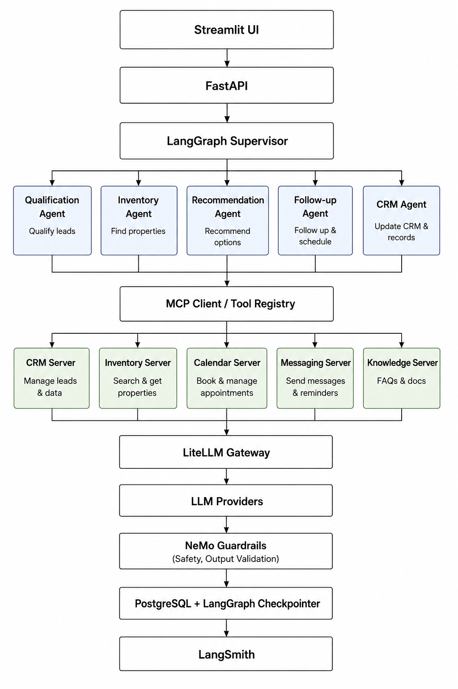

# RealEstate AI Sales OS

> A production-grade multi-agent AI workflow platform for autonomous real estate sales operations.


---

## Overview

RealEstate AI Sales OS is an AI-native workflow platform that automates the end-to-end sales lifecycle for real estate companies. Instead of a traditional chatbot, it uses **stateful multi-agent orchestration** to qualify leads, recommend properties, schedule follow-ups, update CRM records, and coordinate long-running workflows.

The platform demonstrates modern **Agent Engineering**, **AI Systems**, and **LLMOps** practices including durable execution, tool calling through the Model Context Protocol (MCP), workflow checkpointing, observability, and evaluation.

---

## Features

- Multi-agent workflow orchestration using LangGraph
- Stateful execution with persistent checkpoints
- Supervisor-worker agent architecture
- Model Context Protocol (MCP) tool integrations
- Event-driven workflow execution
- Human-in-the-loop approvals
- Multi-model routing with LiteLLM
- Prompt safety using NeMo Guardrails
- AI observability with LangSmith
- Workflow evaluation using DeepEval
- Distributed tracing with OpenTelemetry
- AI Operations Dashboard built with Streamlit

---

# Architecture



The system consists of five major layers:

- **Presentation Layer** — Streamlit AI Operations Dashboard
- **Workflow Layer** — LangGraph Supervisor and specialized agents
- **Tool Layer** — MCP Client and external tool servers
- **LLM Layer** — LiteLLM and foundation models
- **Persistence & Observability Layer** — PostgreSQL, LangSmith

---

# Agent Architecture

## LangGraph Supervisor

Coordinates the entire workflow.

Responsibilities:

- workflow orchestration
- routing
- checkpoint recovery
- retries
- state management
- human approval handling

---

## Qualification Agent

Collects customer requirements and qualifies leads.

- extracts preferences
- scores lead quality
- builds structured customer profile

Uses:

- CRM Server
- Knowledge Server

---

## Inventory Agent

Searches available properties.

- filters inventory
- ranks properties
- retrieves availability

Uses:

- Inventory Server

---

## Recommendation Agent

Generates personalized recommendations.

- compares properties
- explains recommendations
- answers customer queries

Uses:

- Inventory Server
- Knowledge Server

---

## Follow-up Agent

Keeps the sales process moving.

- schedules reminders
- books site visits
- manages follow-ups

Uses:

- Calendar Server
- Messaging Server

---

## CRM Agent

Maintains customer records.

- updates CRM
- stores summaries
- manages workflow status

Uses:

- CRM Server

---

# MCP Tool Servers

The application uses the **Model Context Protocol (MCP)** to decouple AI agents from business tools.

## CRM Server

- Create leads
- Update customer information
- Store notes
- Manage sales stages

---

## Inventory Server

- Search inventory
- Retrieve property details
- Check availability
- Return pricing

---

## Calendar Server

- Schedule site visits
- Cancel appointments
- View availability

---

## Messaging Server

- Send WhatsApp messages
- Send reminders
- Retrieve conversation history

---

## Knowledge Server

- FAQs
- Builder policies
- Payment plans
- Project documentation

---

# Workflow

```
Lead Created
      │
      ▼
LangGraph Supervisor
      │
      ▼
Qualification Agent
      │
      ▼
Inventory Agent
      │
      ▼
Recommendation Agent
      │
      ▼
Follow-up Agent
      │
      ▼
CRM Agent
      │
      ▼
Workflow Complete
```

---

# Tech Stack

## AI

- LangGraph
- LiteLLM
- Model Context Protocol (MCP)
- LangSmith
- DeepEval
- NeMo Guardrails

## Backend

- FastAPI
- PostgreSQL
- Redis Streams
- Celery
- SQLAlchemy
- Pydantic

## Frontend

- Streamlit

## Observability

- LangSmith
- OpenTelemetry
- Structlog

---

# Project Structure

```
realestate-ai-sales-os/
│
├── backend/
│   ├── api/
│   ├── agents/
│   ├── workflows/
│   ├── state/
│   ├── prompts/
│   ├── tools/
│   ├── mcp/
│   ├── database/
│   ├── workers/
│   └── services/
│
├── streamlit/
│
├── evaluation/
│
├── docs/
│
└── README.md
```

